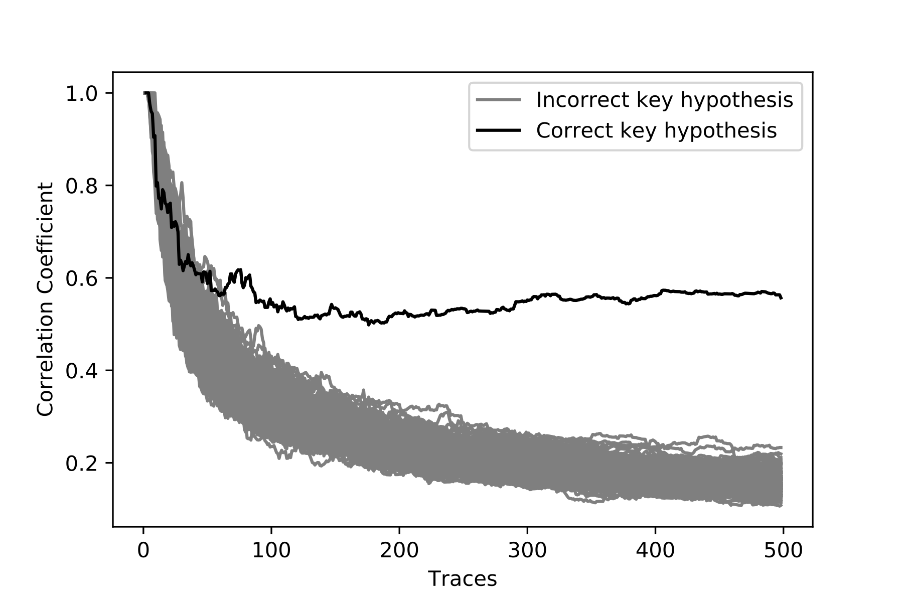
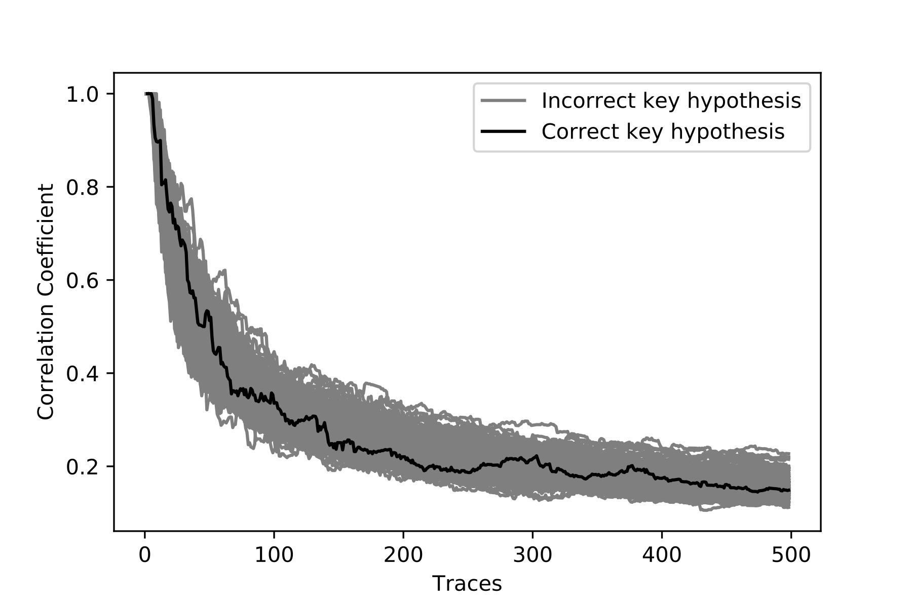

# Differential Power Analysis attack on AES

As part of the Applied Cryptography unit at the University of Bristol, I wrote an implementation of AES in C, implemented a Differential Power Analysis attack in Python that targets software AES implementations, and finally wrote an AES implementation in C that utilises various countermeasures to Differential Power Analysis attacks.

## About

The DPA attack exploits the sbox function of the first round of the AES encryption. Using the hamming weight bus leakage model...

The AES implementations are provided in the `aes.h`, `aes.c`, and `aes-mask.c` files, whilst the DPA attack implementation is provided in the `dpa.py` file.

### Countermeasures

Both 'masking' and 'shuffling' were used as countermeasures against the DPA attack. The implementation utilising these countermeasures successfully prevents a first order DPA attack. In order to analyse the security improvement supplied by the masking implementation, the correlation coefficient calculated for each key hypothesis for 0-500 traces can be plotted. When running the DPA attack against the vanilla AES implementation (the trace file `traces-one.dat` contains traces from the vanilla AES implementation), the correct key hypothesis diverges from the rest of the key hypotheses:



In contrast, when running the DPA attack against the AES implementation utlising masking (the trace file `traces-two.dat` contains traces from the masking AES implementation), no key hypothesis ever diverges from the rest:



## Usage

### Prerequisits

The following packages are required in order to run the AES implementations and the DPA attack:
- Crypto - `pip install pycrypto`
- Numpy - `pip install numpy`

### AES

Compile and run the AES implementation

```console
$ make aes
$ ./aes "Hello, World?"
message    : 48 65 6c 6c 6f 2c 20 57 6f 72 6c 64 3f 00 00 00
key        : d4 96 e8 8f 21 40 55 92 ed 18 62 a9 8c 68 35 e6
ciphertext : 6b 82 1f 23 72 8a 31 f3 76 03 7f 10 5b 9b 29 65
```

### AES with countermeasures

Compile and run the AES implementation as before

```console
$ make aes-mask
$ ./aes-mask "Hello, World?"
message    : 48 65 6c 6c 6f 2c 20 57 6f 72 6c 64 3f 00 00 00
key        : d4 96 e8 8f 21 40 55 92 ed 18 62 a9 8c 68 35 e6
ciphertext : 6b 82 1f 23 72 8a 31 f3 76 03 7f 10 5b 9b 29 65
```

### DPA

Run the DPA attack implementation, providing it with a trace file to attack

```console
$ make dpa
python dpa.py traces-one.dat
Loading traces...
...
```

The Makefile provided runs the DPA attack against the `traces-one.dat` trace file. To run the DPA against another trace file, simply run it with Python directly

```console
$ python dpa.py traces-two.dat
Loading traces...
...
```

Two sample trace files are provided. `traces-one.dat` contains a trace set recorded from the AES implementation with no countermeasures implemented (`aes.c`). `traces-two.dat` contains a trace set recorded from the software AES implementation that utilises masking (`aes-mask.c`).
